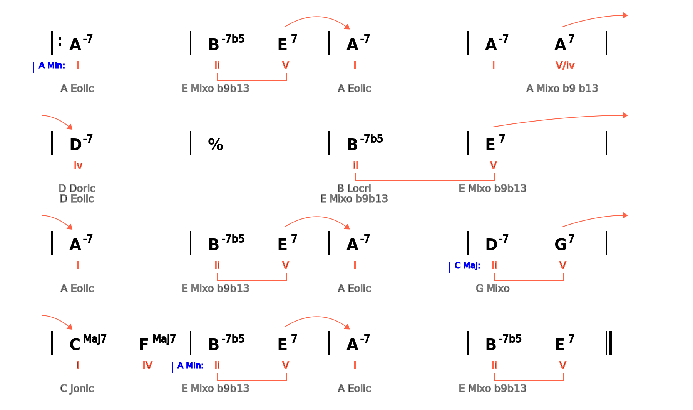

# ChordProgressions

ChordProgressions is an API for describing the chord progression of a song using XML and render it in SVG and PNG.

It can include:

- Chord root (C, Eb, F#, ...)
- Chord species (-, -7, Maj7, 6, ...)
- Keys (C Major, A minor, ...)
- Grades per chord (I, ii, iii, IV, V, vi, vii°, ...)
- V --> I and ii --> V symbols (arrows and claudators, solid or dashed) 
- Sections (A, B, ...)
- Repeat signs (firs ending, second ending, ...)
- Used scales on the chord (Ionian, Dorian, Pentatonic ...)

## Syntax

The main tag in any chord progression is `<song>`. It can include the following tags:`
* `<title>`,
* `<composer>`, and
* a list of `<measures>`.

Additionally, it can include also formatting tags like:
* `<measures_per_line>`, or
* `<chords_per_measure>`.

The `<measures>` tag can include as many `<measure>` tags as required and each `<measure>` tag may include:
* a list of `<chord>` tags,
* `<section>`, 
* `<init_bar>`, `<end_bar>` or `<repeat_bar>` tag to indicate which bar separation must be included, as well as
* `<first_end>` or `<second_end>` tags to include these special symbols.

Finally, every `<chord>` tag includes:
* `<root>`,
* `<specie>`, and optionally
* `<grade>`,
* `<new_key>`,
* `<ii_bracket>`, `<subii_bracket>`, `<v_i_arrow>` or `<subv_i_arrow>` standard harmony analysis symbols and
* `<scale>`.

## Example

You can see how the popular song *Summertime* is codified in `XML` using `ChordProgressions` [here](./XML_songs/summertime.xml)]. The XML file is rendered to SVG and PNG using:

```bash
python3 render_chord_progression.py XML_songs/summertime.xml 1.5
```
and the result looks like this:



*Code created by Narcís Palomeras*